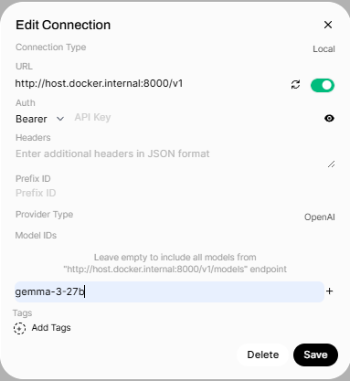

#  Ollama Paragraph Summarizer

A lightweight Chrome extension that summarizes text paragraphs using locally-hosted Ollama LLMs.
Includes Docker Compose setup with Open-WebUI for easy deployment and model management.


## Installation

Install Ollama with `brew install ollama` or by downloading an [installer](https://ollama.com/download/windows).

### Mac with Apple Silicon

1. `./ollama-entrypoint.sh`  
2. `docker compose up --no-deps open-webui`

### Windows/Linux

1. If an NVIDIA device is available, uncomment the section `ollama.deploy` of `docker-compose.yaml`
2. `docker compose up`

## Chrome Extension

1. Open `chrome://extensions/`
2. Click on `Load unpacked` and then select the project directory
3. Enable the `Paragraph Summarizer` extension
4. Open some [news](https://finance.yahoo.com/) and see summarization in action by clicking on a paragraph
   - it usually takes longer to process the first click on a page

## Add a new model

By default, three models are downloaded: `llama3.1:8b`, `llama3.2:1b`, `llama3.2:3b`.
These are selectable in the extension's `Options` menu.

Load additional models in `ollama_entrypoint.sh` or via `http://localhost:3000/admin/settings/models`.
Make sure new models are added to `options.html` and reload the extension.

## Create an endpoint with vLLM

1. Create and activate the environment
- `uv venv && uv pip install vllm`
- `source .venv/bin/activate`

2. Download a model
- `git clone https://huggingface.co/google/gemma-3-27b-it-qat-q4_0-gguf && cd gemma-3-27b-it-qat-q4_0-gguf`
- `git lfs pull && cd ..`
- ```
  huggingface-cli download google/gemma-3-27b-it \
   --include "tokenizer*" "*.json" "*.model" \
   --local-dir ./gemma-3-27b-it-qat-q4_0-gguf
  ```
3. Run a server
```
vllm serve ./gemma-3-27b-it-qat-q4_0-gguf/gemma-3-27b-it-q4_0.gguf \
  --host 0.0.0.0 \
  --port 8000 \
  --max-model-len 4096 \
  --max-num-batched-tokens 4096 \
  --dtype auto \
  --tokenizer ./gemma-3-27b-it-qat-q4_0-gguf \
  --served-model-name "gemma-3-27b" \
  --gpu-memory-utilization 0.95
```
4. Search for "OpenAI API" mentions in `background.js` and make necessary changes
5. To add the models to WebUI go to `http://localhost:3000/admin/settings/connections` and add a new "OpenAI API" connection

